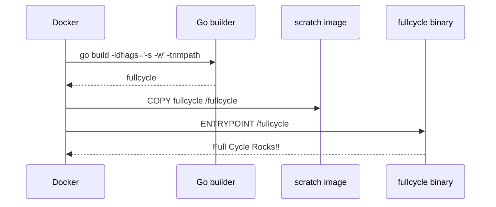

# fullcycle-docker-challenge

Docker image name: `fullcycle-go`

```mermaid
sequenceDiagram
    participant Docker
    participant Builder as Go builder
    participant Runtime as scratch image
    participant App as fullcycle binary

    Docker->>Builder: go build -ldflags='-s -w' -trimpath
    Builder-->>Docker: fullcycle
    Docker->>Runtime: COPY fullcycle /fullcycle
    Docker->>App: ENTRYPOINT /fullcycle
    App-->>Docker: Full Cycle Rocks!!
```